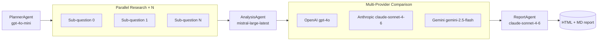

# LCLG — LangChain + Axemere Gateway

[](LICENSE)

A public reference implementation showing how to route a multi-agent LangChain research
pipeline through the [Axemere Managed Gateway](https://axemere.ai). Every LLM call is
governed — no provider API keys needed on the client.

---

## Table of Contents

- [What it does](#what-it-does)
- [Prerequisites](#prerequisites)
- [Install](#install)
- [Configure](#configure)
- [Run](#run)
- [Example output](#example-output)
- [Integration modes](#integration-modes)
- [Project structure](#project-structure)
- [Development](#development)

---

## What it does

Five specialized agents run in sequence:



| Agent | Provider | Workload |
|-------|----------|----------|
| Planner | OpenAI `gpt-4o-mini` | `wl_lclg_planner` |
| Researcher × N | Anthropic `claude-haiku-4-5` | `wl_lclg_researcher` |
| Analyst | Mistral `mistral-large-latest` | `wl_lclg_analyst` |
| Comparator | OpenAI + Anthropic + Google (parallel) | `wl_lclg_comparator` |
| Reporter | Anthropic `claude-sonnet-4-6` | `wl_lclg_reporter` |

Every call is governed by the Axemere gateway: attributed to a project and workload,
metered, and subject to your organisation's policies. The final HTML report includes a
full cost and attribution breakdown.

---

## Prerequisites

See [docs/prerequisites.md](docs/prerequisites.md) for detailed setup instructions for
each gateway variant (Managed, Self-Hosted, Free).

**Quick summary:**

| Variant | What you need |
|---------|--------------|
| Managed Gateway | Axemere account, API key, Project ID |
| Self-Hosted / Free | Docker, gateway URL |
| Tavily web search | Free Tavily API key (optional) |

---

## Install

```bash
# Clone and enter the repo
git clone https://github.com/Axemere-LLC/langchain-gateway-demo
cd langchain-gateway-demo

# Install (requires Python 3.11+)
make install
```

---

## Configure

Copy `.env.example` to `.env` and fill in your values:

```bash
cp .env.example .env
```

Minimum required variables (Managed Gateway):

```bash
LCLG_MODE=explicit-managed
AXEMERE_GATEWAY_TOKEN=axemere_k_...
AXEMERE_PROJECT_ID=prj_lclg_demo
```

For the Free Gateway (no Axemere account required):

```bash
LCLG_MODE=explicit-selfhosted
AXEMERE_GATEWAY_URL=http://localhost:7080
# Add provider API keys to the gateway config, not here
```

---

## Run

```bash
# Simplest run
TOPIC="solid state battery materials 2026" make run

# Or directly
python -m lclg --topic "solid state battery materials 2026"

# Override the integration mode
LCLG_MODE=proxy-managed python -m lclg --topic "..."

# Re-render the last cached report (no LLM calls)
make report
```

Reports are written to `output/<run-id>/`:

```
output/
└── a1b2c3d4/
    ├── pipeline_result.json   # Full pipeline output (cache for --render-only)
    ├── report.html            # Self-contained HTML report with cost breakdown
    └── report.md              # Markdown version for GitHub
```

---

## Example output

The HTML report includes:

- **Pipeline diagram** — Mermaid flowchart of the exact run
- **Research findings** — per sub-question, labelled Web Search or Model Knowledge
- **Analysis synthesis** — Mistral's cross-source narrative
- **Provider comparison** — side-by-side responses + latency + cost from three providers
- **Executive report** — final synthesis from the Reporter agent
- **Attribution breakdown** — every gateway call with workload, record ID, and cost

---

## Integration modes

Set `LCLG_MODE` to choose how LLM calls reach the gateway:

| Mode | LangChain class | Auth header | When to use |
|------|----------------|-------------|-------------|
| `explicit-managed` | `ChatAiGateway` | `Bearer axemere_k_...` | Managed gateway, first-class attribution |
| `explicit-selfhosted` | `ChatAiGateway` | none | Self-hosted / Free gateway |
| `proxy-managed` | `ChatOpenAI` / `ChatAnthropic` / `ChatMistralAI` | via header | Migrating an existing app |
| `proxy-selfhosted` | `ChatOpenAI` / `ChatAnthropic` / `ChatMistralAI` | none | Migrating, self-hosted |

The ComparatorAgent always uses `ChatAiGateway` explicit mode regardless of `LCLG_MODE`
because Gemini's `generateContent` API is not compatible with the OpenAI proxy format.
See [docs/gateway-integration.md](docs/gateway-integration.md) for details.

---

## Project structure

```
lclg/
├── src/lclg/
│   ├── config.py          # LCLGConfig + workload ID constants
│   ├── pipeline.py        # Orchestrates all five agents
│   ├── modes/             # Builder functions for each integration mode
│   ├── agents/            # One file per agent
│   └── report/            # HTML + Markdown report rendering
├── tests/                 # pytest test suite (49 tests)
├── docs/                  # Architecture, agents, integration guide, prerequisites
├── output/                # Generated reports (gitignored)
├── .env.example           # All env vars with descriptions
└── Makefile               # install, run, test, lint, report, clean, help
```

---

## Development

```bash
make help         # list all targets
make test         # pytest (49 tests)
make lint         # ruff + mypy
make format       # ruff format --fix
make clean        # remove output/, caches, build artifacts
```

See [docs/architecture.md](docs/architecture.md) for the full design, and
[docs/gateway-integration.md](docs/gateway-integration.md) for the gateway
integration deep-dive.
