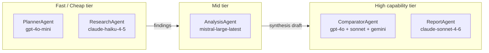

# Agents

## Table of Contents

- [Overview](#overview)
- [Agent Definitions](#agent-definitions)
- [Model Tier Rationale](#model-tier-rationale)
- [Attribution Labels](#attribution-labels)
- [Workload Registration](#workload-registration)
- [Related Documents](#related-documents)

---

## Overview

Each agent is a LangChain [LCEL](glossary.md#lcel) chain built on
[`ChatAiGateway`](glossary.md#chatmvgc) — the Axemere LangChain integration class.
Every agent declares its own [`workload_id`](glossary.md#workload) so cost and
usage are tracked at agent granularity in the Axemere console, not just at the
application level.

Agents are implemented in `src/lclg/agents/`, one file per agent, each
exporting a `build_<name>_chain(cfg: LCLGConfig)` function that returns a
LangChain runnable.

The `ResearchAgent` uses LangChain tool calling with Tavily web search when
`TAVILY_API_KEY` is set; it falls back to the model's training knowledge
otherwise. The report annotates each finding with its source.

The `ComparatorAgent` always uses `ChatAiGateway` in explicit mode for all three
providers, regardless of `LCLG_MODE`. See
[gateway-integration.md — Gemini in Proxy Mode](gateway-integration.md#gemini-in-proxy-mode)
for the rationale.

---

## Agent Definitions

| Agent | File | Provider | Model | Workload ID | Role |
|-------|------|----------|-------|-------------|------|
| `PlannerAgent` | `planner.py` | OpenAI | `gpt-4o-mini` | `wl_lclg_planner` | Decompose topic into N sub-questions |
| `ResearchAgent` | `researcher.py` | Anthropic | `claude-haiku-4-5-20251001` | `wl_lclg_researcher` | Gather facts per sub-question via Tavily web search (or model knowledge if no Tavily key) — runs N times in parallel |
| `AnalysisAgent` | `analyst.py` | Mistral | `mistral-large-latest` | `wl_lclg_analyst` | Synthesize research findings into a coherent narrative |
| `ComparatorAgent` | `comparator.py` | OpenAI + Anthropic + Gemini | `gpt-4o` / `claude-sonnet-4-6` / `gemini-2.5-flash` | `wl_lclg_comparator` | Fan out same prompt to three providers in parallel via `ChatAiGateway` explicit mode (always); capture response, latency, and cost |
| `ReportAgent` | `reporter.py` | Anthropic | `claude-sonnet-4-6` | `wl_lclg_reporter` | Generate final structured HTML/Markdown report |

---

## Model Tier Rationale

A deliberate goal of this demo is to show that different tasks warrant different
model tiers, and that the Axemere gateway manages credentials for all of them
from a single configuration.



| Tier | Agents | Why |
|------|--------|-----|
| Fast / Cheap | Planner, Researcher | High call volume (N parallel research calls); task complexity is low — decomposition and fact-gathering don't require frontier capability |
| Mid | Analyst | Synthesis requires reasoning across sources; Mistral Large demonstrates a third provider beyond OpenAI/Anthropic |
| High capability | Comparator, Reporter | Comparator intentionally uses top-tier models from three providers to make the comparison meaningful; Reporter needs quality output for the final artifact |

---

## Attribution Labels

Every agent call includes `attribution.labels` so pipeline runs can be filtered
and grouped in the Axemere console independently of `workload_id`.

```python
labels = {
    "agent": "researcher",   # agent role name — matches workload suffix
    "run_id": run_id,        # short UUID generated once per pipeline invocation
}
```

[`project_id`](glossary.md#project-id) is **not** a label — it is set once via
`AXEMERE_PROJECT_ID` and flows through `AiGatewayConfig.from_env()` to every call
automatically. Labels are reserved for per-call metadata that isn't already a
first-class [attribution](glossary.md#attribution) field.

The `run_id` label enables filtering all records from a single pipeline run in
the Axemere console (e.g. `label:run_id=67a2fcc6`). It is set by `_llm.py`
automatically on every call so agent code doesn't need to pass it explicitly.

### Teaching comment template for attribution decisions

```python
# [AXEMERE] attribution.labels — per-call metadata
# We use labels for agent name and pipeline run ID (run_id).
# run_id is a short UUID added by _llm.py to every call in a pipeline run,
# enabling filtering all records from one run in the Axemere console.
# project_id is intentionally NOT a label — it is a first-class attribution
# field set via AXEMERE_PROJECT_ID / AiGatewayConfig.project_id.
# Alternatives:
#   A) Set default_project_id on the workload in the console — then the
#      calling code never needs to specify project_id at all.
#   B) Pass project_id per-call via AiGatewayConfig overrides — useful when
#      different pipeline runs should bill to different projects.
# Docs: https://axemere.ai/docs/attribution
```

---

## Workload Registration

In self-hosted mode, workloads must be registered with the gateway before use.
In managed mode, workloads are created in the Axemere console.

The five workload IDs used by this project:

```
wl_lclg_planner
wl_lclg_researcher
wl_lclg_analyst
wl_lclg_comparator
wl_lclg_reporter
```

All are prefixed `wl_` per Axemere [workload](glossary.md#workload) naming
conventions, and all share the same [`project_id`](glossary.md#project-id)
(`AXEMERE_PROJECT_ID`) so the full pipeline cost is visible as a single project
in the console.

---

## Related Documents

- [docs/architecture.md](architecture.md) — pipeline overview and diagrams
- [docs/gateway-integration.md](gateway-integration.md) — how agents connect to the gateway
- [docs/glossary.md](glossary.md) — term definitions
