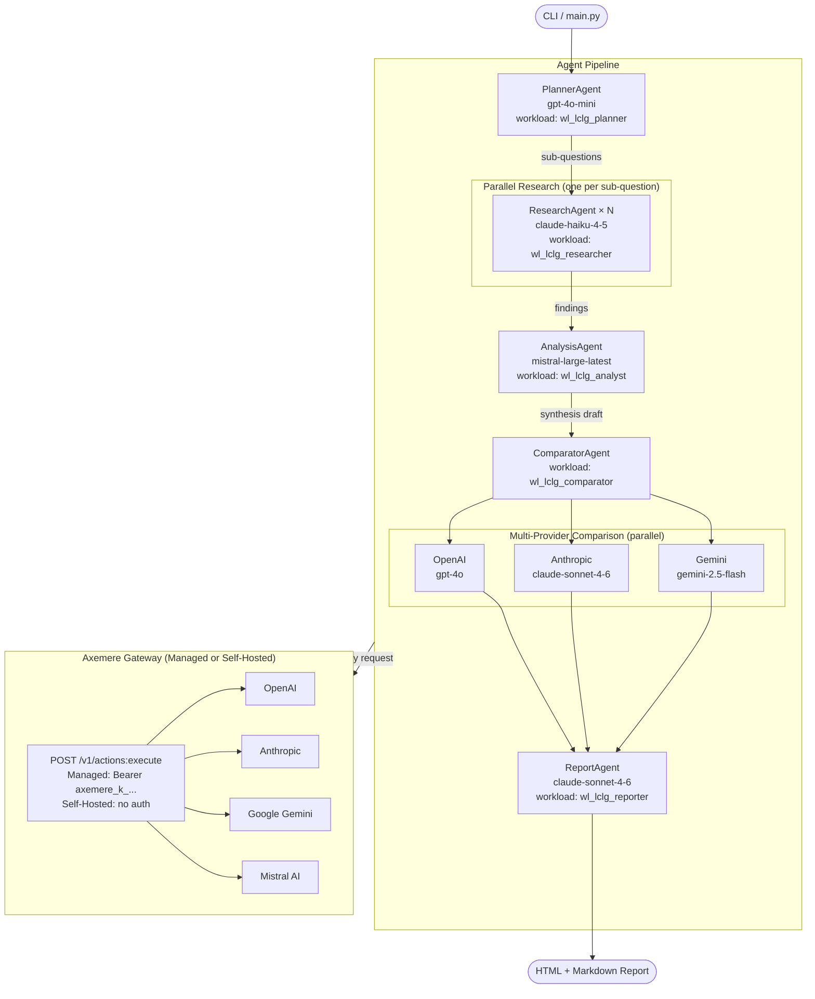
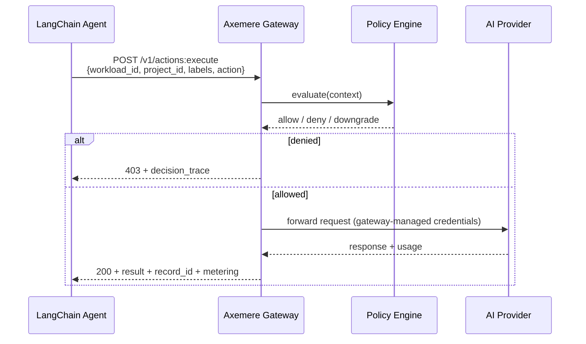
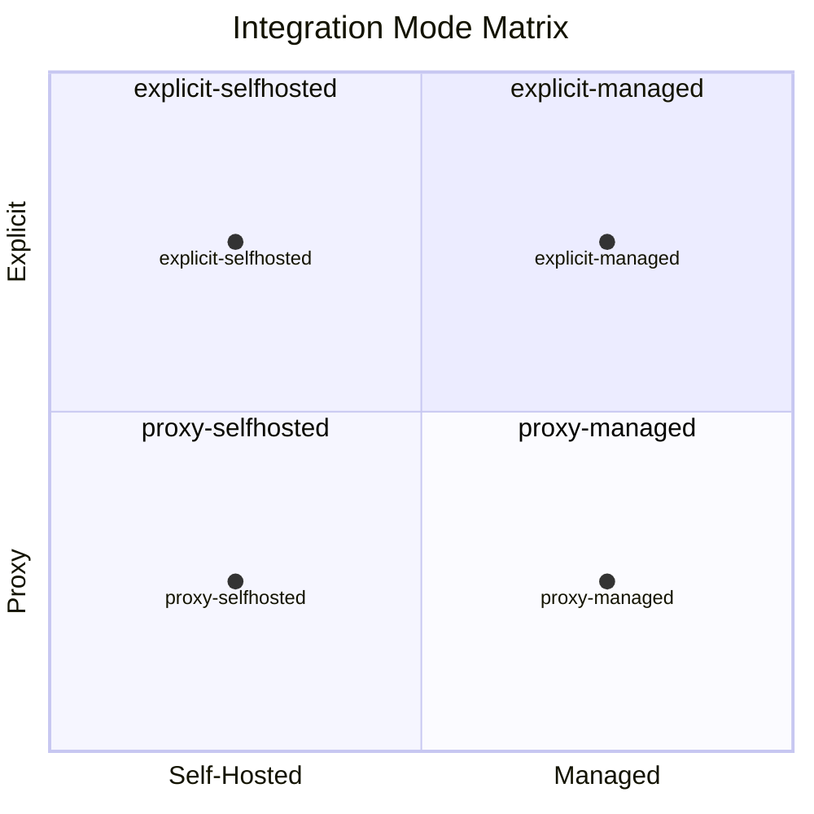

# Architecture

## Table of Contents

- [Purpose](#purpose)
- [Pipeline Overview](#pipeline-overview)
- [Request Flow](#request-flow)
- [Integration Modes](#integration-modes)
- [Related Documents](#related-documents)

---

## Purpose

LCLG ("LangChain + LLM Gateway") is a public reference implementation that
answers the question: _"What does it actually look like to wire a multi-agent
LangChain workflow through the Axemere gateway, with each agent attributed to a
project and routed to the right provider?"_

Given a research topic (e.g. `"solid state battery materials 2026"`), the
pipeline fans out across five specialized agents and produces a structured HTML
and Markdown research report. Every LLM call is routed through the Axemere
[gateway](glossary.md#gateway) — no provider API keys are needed in the local
environment.

The pipeline demonstrates three distinct Axemere value propositions:

1. **Per-agent attribution** — each agent declares its own
   [`workload_id`](glossary.md#workload) and
   [`labels`](glossary.md#attribution-labels), so cost and usage are tracked at
   agent granularity in the console.
2. **Model-tier routing** — cheap/fast models handle high-volume tasks; capable
   models handle synthesis. The gateway manages all provider credentials.
3. **Multi-provider comparison** — the `ComparatorAgent` fans the same synthesis
   prompt to OpenAI, Anthropic, and Google Gemini in parallel via
   [`RunnableParallel`](glossary.md#runnableparallel), and the report surfaces
   latency, token count, cost, and response quality side by side.

---

## Pipeline Overview

Each agent is assigned to a specific model and provider chosen to illustrate
model-tier routing. See [docs/agents.md](agents.md) for the full rationale and
workload assignments.

---

## Request Flow

Every agent call — regardless of integration mode — follows this path through
the gateway:

Key properties:
- **No provider credentials in the client** — the gateway holds them
- **Every call is recorded** — `record_id` and `metering.usd_charged` are
  returned in every successful response
- **Policy is enforced before forwarding** — a denied request never reaches the
  provider

---

## Integration Modes

The pipeline ships four runnable configurations selected via `LCLG_MODE`.
All four produce identical output — the mode only changes how the LangChain
code talks to the gateway.

| `LCLG_MODE` | Gateway | How LangChain connects | Auth |
|-------------|---------|------------------------|------|
| `explicit-managed` *(default)* | `https://us.gw.axemere.ai` | `ChatAiGateway` → `POST /v1/actions:execute` | `Bearer mvgc_k_...` |
| `explicit-selfhosted` | `http://localhost:7080` | `ChatAiGateway` → `POST /v1/actions:execute` | None |
| `proxy-managed` | `https://us.gw.axemere.ai` | `ChatOpenAI` / `ChatAnthropic` / `ChatMistralAI` via gateway proxy | `Bearer mvgc_k_...` |
| `proxy-selfhosted` | `http://localhost:7080` | `ChatOpenAI` / `ChatAnthropic` / `ChatMistralAI` via gateway proxy | None |

`explicit-managed` is the recommended starting point — attribution is
first-class in the request body and the full gateway feature set is available.
See [docs/gateway-integration.md](gateway-integration.md) for a deep-dive on
each mode with code examples and tradeoff comments.

**Gateway variants tested before release:**

| Variant | `AXEMERE_GATEWAY_URL` | Account required | Provider keys |
|---------|--------------------|-----------------|---------------|
| Managed Gateway | `https://us.gw.axemere.ai` | Yes (Axemere) | Managed by Axemere |
| Self-Hosted Gateway | `http://localhost:7080` | Yes (Axemere, for CP connection) | Managed by Axemere |
| Free Gateway | `http://localhost:7080` | No | Supplied by the user to the gateway config |

All three use the same four `LCLG_MODE` values — the `selfhosted` modes work
for both Self-Hosted and Free Gateway. See
[docs/prerequisites.md](prerequisites.md) for setup instructions for each variant.

---

## Related Documents

- [docs/agents.md](agents.md) — per-agent model assignments, workload IDs, attribution labels
- [docs/gateway-integration.md](gateway-integration.md) — integration mode details, wire format, SDK usage
- [docs/report-format.md](report-format.md) — output report structure
- [docs/glossary.md](glossary.md) — term definitions
- [docs/specs/sdk-public-release.md](specs/sdk-public-release.md) — PLANNED: public SDK and PyPI release
- [docs/specs/public-repo-launch.md](specs/public-repo-launch.md) — PLANNED: repository structure, sanitization, and launch sequence
