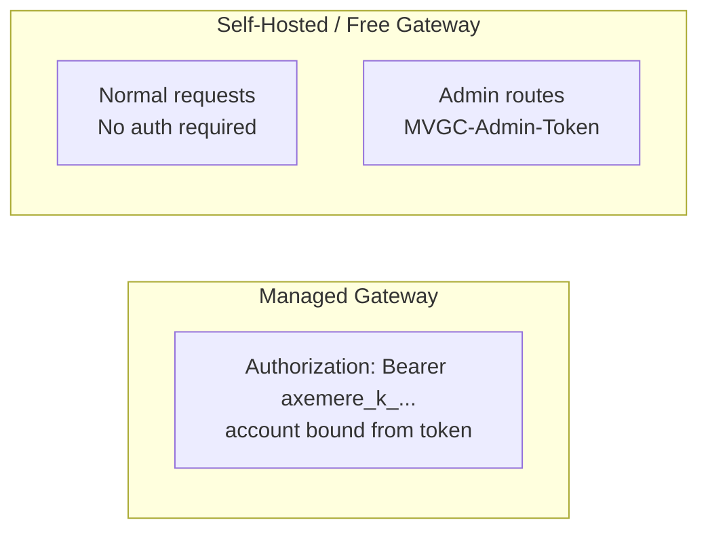
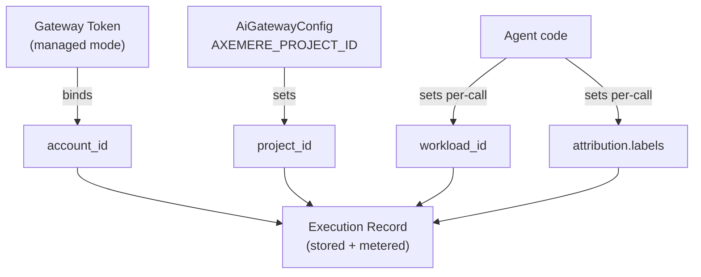

# Gateway Integration

## Table of Contents

- [Overview](#overview)
- [Integration Modes](#integration-modes)
  - [Explicit + Managed](#explicit--managed-default)
  - [Explicit + Self-Hosted](#explicit--self-hosted)
  - [Proxy + Managed](#proxy--managed)
  - [Proxy + Self-Hosted](#proxy--self-hosted)
- [Wire Format](#wire-format)
- [Authentication](#authentication)
- [Attribution](#attribution)
- [Environment Variables](#environment-variables)
- [Error Handling](#error-handling)
- [What You Do Not Need Locally](#what-you-do-not-need-locally)
- [Gemini in Proxy Mode](#gemini-in-proxy-mode)
- [SDK Reference](#sdk-reference)
- [Related Documents](#related-documents)

---

## Overview

Every LLM call in this pipeline is routed through the Axemere
[gateway](glossary.md#gateway) rather than calling providers directly. The
gateway enforces policy, manages provider credentials, and records every request
for attribution and cost tracking.

The pipeline supports four integration modes, selected via `LCLG_MODE`. They
all produce identical output — the mode only changes how LangChain code connects
to the gateway. Read all four; the `[AXEMERE]` teaching comments in each explain
when you would choose it in your own application.

---

## Integration Modes

### Explicit + Managed *(default)*

Your code sends a fully-formed `mvgc.action_request.v2` JSON body to the
Axemere managed gateway. [`ChatAiGateway`](glossary.md#chataigateway) handles
this transparently as a standard LangChain `BaseChatModel`.

```python
# [AXEMERE] Explicit mode — ChatAiGateway → POST /v1/actions:execute
# Attribution fields (workload_id, project_id, labels) are first-class in the
# request body. This is the most explicit and observable integration pattern.
# Alternatives:
#   A) Proxy mode — use ChatOpenAI/ChatAnthropic pointed at the gateway instead.
#      Zero code changes if you're migrating an existing app; attribution via headers.
#   B) Self-hosted — swap AXEMERE_GATEWAY_URL to http://localhost:7080; no token needed.
# Docs: https://axemere.ai/docs/guides/developer-integration
from axemere.gateway import AiGatewayConfig
from axemere.gateway.langchain import ChatAiGateway

cfg = AiGatewayConfig.from_env()   # reads AXEMERE_GATEWAY_TOKEN, AXEMERE_GATEWAY_URL, etc.

llm = ChatAiGateway(
    provider="openai",
    model="gpt-4o-mini",
    config=cfg,
)
response = llm.invoke("Hello")
```

**Gateway:** `https://us.gw.axemere.ai`
**Auth:** `Authorization: Bearer axemere_k_...`

---

### Explicit + Self-Hosted

Same `ChatAiGateway` code; only `AXEMERE_GATEWAY_URL` changes. No token is
required for normal requests to a self-hosted or Free Gateway instance.

```python
# [AXEMERE] Self-hosted gateway — no auth for normal requests
# The self-hosted and Free Gateway variants do not apply authentication
# middleware to POST /v1/actions:execute. MVGC-Admin-Token is only required
# for admin routes (/v1/dashboard/*, /v1/records/*).
# Alternatives:
#   A) Managed gateway — set AXEMERE_GATEWAY_URL=https://us.gw.axemere.ai and
#      provide AXEMERE_GATEWAY_TOKEN. Axemere manages infrastructure and credentials.
# Docs: https://axemere.ai/docs/guides/it-setup/docker
from axemere.gateway import AiGatewayConfig
from axemere.gateway.langchain import ChatAiGateway

cfg = AiGatewayConfig.from_env()   # AXEMERE_GATEWAY_URL=http://localhost:7080

llm = ChatAiGateway(
    provider="openai",
    model="gpt-4o-mini",
    config=cfg,
)
response = llm.invoke("Hello")
```

**Gateway:** `http://localhost:7080` (Free Gateway or Self-Hosted — run via `docker compose up`)
**Auth:** None for normal requests

---

### Proxy + Managed

Standard LangChain provider classes (`ChatOpenAI`, `ChatAnthropic`,
`ChatMistralAI`) with `base_url` pointed at the gateway. No changes to
calling patterns. Attribution is injected as HTTP headers.

```python
# [AXEMERE] Proxy mode — standard LangChain classes through the gateway
# The gateway intercepts standard provider API calls transparently.
# No changes to the calling code beyond base_url and headers.
# Best for: migrating an existing LangChain app to use the gateway without
# rewriting agent code.
# Alternatives:
#   A) Explicit mode — use ChatAiGateway for first-class attribution in the request
#      body. More observable; recommended for new code.
# Docs: https://axemere.ai/docs/guides/developer-integration
import httpx
from axemere.gateway import AiGatewayConfig
from axemere.gateway.langchain import ai_gateway_openai_client
from langchain_openai import ChatOpenAI

cfg = AiGatewayConfig.from_env()

# ai_gateway_openai_client() returns a pre-configured openai.OpenAI client
# with the gateway base_url and X-MVGC-* attribution headers already set.
hook_client = httpx.Client()
openai_client = ai_gateway_openai_client(cfg, http_client=hook_client)
llm = ChatOpenAI(model="gpt-4o-mini", openai_api_client=openai_client)
response = llm.invoke("Hello")
```

**Gateway:** `https://us.gw.axemere.ai`
**Auth:** `Authorization: Bearer axemere_k_...` (injected by `ai_gateway_openai_client()`)

---

### Proxy + Self-Hosted

Same proxy pattern; gateway URL points to the local instance.

```python
# [AXEMERE] Proxy mode + self-hosted / Free Gateway
# Combine the migration-friendly proxy pattern with a locally-run gateway.
# Useful for development and testing without a managed account.
# Docs: https://axemere.ai/docs/guides/it-setup/docker
import httpx
from axemere.gateway import AiGatewayConfig
from axemere.gateway.langchain import ai_gateway_openai_client
from langchain_openai import ChatOpenAI

# AXEMERE_GATEWAY_URL=http://localhost:7080 set in environment
cfg = AiGatewayConfig.from_env()
hook_client = httpx.Client()
openai_client = ai_gateway_openai_client(cfg, http_client=hook_client)
llm = ChatOpenAI(model="gpt-4o-mini", openai_api_client=openai_client)
response = llm.invoke("Hello")
```

**Gateway:** `http://localhost:7080`
**Auth:** None

---

## Wire Format

In explicit mode, `ChatAiGateway` builds and sends an `mvgc.action_request.v2`
document to `POST /v1/actions:execute`:

```json
{
  "schema": "mvgc.action_request.v2",
  "request_id": "<uuid-v4>",
  "workload_id": "wl_lclg_planner",
  "ingress_mode": "explicit_action_request",
  "action": {
    "type": "llm_chat",
    "method": "POST",
    "target_host": "api.openai.com",
    "target_path": "/v1/chat/completions",
    "params": {
      "model": "gpt-4o-mini",
      "messages": [{"role": "user", "content": "..."}],
      "max_tokens": 256
    }
  },
  "attribution": {
    "project_id": "prj_lclg_demo",
    "labels": {
      "agent": "planner",
      "run_id": "67a2fcc6"
    }
  }
}
```

A successful response includes the provider response body plus gateway metadata:

```json
{
  "decision": "allow",
  "record_id": "<uuid>",
  "result": {
    "body": { "choices": [...], "usage": {...} }
  },
  "metering": {
    "tokens_in": 256,
    "tokens_out": 56,
    "usd_charged": "0.00021"
  }
}
```

`record_id` and `metering` are surfaced in `ChatGeneration.generation_info`
so the pipeline can build the cost breakdown without a separate API call.

---

## Authentication



| Gateway | Route | Auth |
|---------|-------|------|
| Managed | `POST /v1/actions:execute` | `Authorization: Bearer axemere_k_<token>` |
| Managed | `GET /proxy/*` | `Authorization: Bearer axemere_k_<token>` |
| Self-Hosted / Free | `POST /v1/actions:execute` | None |
| Self-Hosted / Free | `GET /proxy/*` | None |
| Self-Hosted / Free | `GET /v1/dashboard/*`, `GET /v1/records/*` | `MVGC-Admin-Token` header |

In managed mode, the account is bound server-side from the gateway token.

---

## Attribution



| Field | Set by | Scope |
|-------|--------|-------|
| `workload_id` | Each agent — `wl_lclg_<agent>` | Agent |
| `project_id` | `AXEMERE_PROJECT_ID` env var via `AiGatewayConfig` | Billing / chargeback |
| `labels` | Agent code — `agent`, `run_id` | Per-call metadata |

See [docs/agents.md](agents.md#attribution-labels) for the full label schema
and teaching comment template.

---

## Environment Variables

All `AXEMERE_*` variables are read by `AiGatewayConfig.from_env()`. `.env.example` is
the authoritative reference with inline descriptions; this table provides a
quick overview.

| Variable | Required | Default | Description |
|----------|----------|---------|-------------|
| `LCLG_MODE` | No | `explicit-managed` | `explicit-managed` \| `explicit-selfhosted` \| `proxy-managed` \| `proxy-selfhosted` |
| `AXEMERE_GATEWAY_TOKEN` | Managed modes | — | Axemere gateway bearer token; not required for self-hosted modes |
| `AXEMERE_GATEWAY_URL` | No | `https://us.gw.axemere.ai` | Override to `http://localhost:7080` for self-hosted / Free Gateway |
| `AXEMERE_WORKLOAD_ID` | No | `wl_lclg_demo` | Default workload; each agent overrides per-call |
| `AXEMERE_PROJECT_ID` | Yes | — | Attribution project ID (required by default gateway policy) |
| `AXEMERE_CUSTOMER_ID` | No | — | Optional customer attribution |
| `LCLG_MAX_SUB_QUESTIONS` | No | `4` | Max sub-questions the PlannerAgent will generate |
| `LCLG_OUTPUT_DIR` | No | `./output` | Directory for generated reports |
| `TAVILY_API_KEY` | No | — | Enables web search in ResearchAgent; falls back to model knowledge if absent |

No provider API keys (`OPENAI_API_KEY`, `ANTHROPIC_API_KEY`, etc.) are needed
in any mode — the gateway manages all provider credentials.

---

## Error Handling

```python
from axemere.gateway import GatewayError, PolicyDeniedError

try:
    response = llm.invoke(prompt)
except PolicyDeniedError as exc:
    # [AXEMERE] Policy denial
    # The gateway evaluated the request and denied it. The exception message
    # explains why (e.g. missing project_id, budget exceeded, policy rule matched).
    # Do NOT retry without fixing the underlying condition.
    # Docs: https://axemere.ai/docs/guides/configuration/policies
    logger.error("gateway denied request", error=str(exc))
    raise
except GatewayError as exc:
    # [AXEMERE] Gateway connectivity / protocol error
    # Network failure, gateway not running, or unexpected response format.
    # Safe to retry with backoff. For self-hosted: check docker compose up.
    # Docs: https://axemere.ai/docs/guides/it-setup/docker
    logger.error("gateway error", error=str(exc))
    raise
```

---

## What You Do Not Need Locally

Provider API keys (`OPENAI_API_KEY`, `ANTHROPIC_API_KEY`, `GOOGLE_API_KEY`,
etc.) are managed by the gateway in all four modes. The gateway holds
credentials for all configured providers; the client never sees them.

What you need varies by mode:

| Mode | Required locally |
|------|-----------------|
| Explicit + Managed | `AXEMERE_GATEWAY_TOKEN` (`axemere_k_...`) |
| Proxy + Managed | `AXEMERE_GATEWAY_TOKEN` (`axemere_k_...`) |
| Explicit + Self-Hosted / Free | Gateway running (`docker compose up`) |
| Proxy + Self-Hosted / Free | Gateway running (`docker compose up`) |

See [docs/prerequisites.md](prerequisites.md) for the full account and
credential setup guide, including the Free Gateway Docker quickstart.

---

## Gemini in Proxy Mode

```python
# [AXEMERE] Why Gemini uses explicit mode even in proxy-* configurations
# The Gemini API uses a different request format than OpenAI (generateContent
# vs chat/completions). The gateway's Gemini connector translates correctly
# in explicit mode — the action request carries a Gemini-formatted body.
# In proxy mode, the standard ChatGoogleGenerativeAI SDK sends a Gemini-native
# request body, but the proxy path routing does not do format translation.
# Decision: the ComparatorAgent always uses ChatAiGateway(provider="google", ...)
# regardless of LCLG_MODE. This is a deliberate design choice, not a gap.
# Alternatives:
#   A) Add an OpenAI→Gemini translation layer to the gateway's /proxy/gemini
#      path — possible but adds gateway complexity for a single provider edge case.
#   B) Use ChatOpenAI pointed at Google's own OpenAI-compatible endpoint — works
#      but bypasses the gateway entirely for Gemini.
# Docs: https://axemere.ai/docs/guides/developer-integration
```

In practice: `LCLG_MODE` controls how the Planner, Researcher, Analyst, and
Reporter agents connect. The ComparatorAgent always uses `ChatAiGateway` for
all three providers (OpenAI, Anthropic, Gemini) so the multi-provider fan-out
is consistent regardless of mode.

---

## SDK Reference

The `axemere-gateway` and `axemere-gateway-langchain` packages are on PyPI.
Install them via:

```bash
pip install axemere-gateway axemere-gateway-langchain
```

`lclg` declares both as dependencies in `pyproject.toml`, so `make install`
handles this automatically.

| Symbol | Module | Description |
|--------|--------|-------------|
| `AiGatewayConfig` | `axemere.gateway` | Config dataclass; reads `AXEMERE_*` env vars |
| `ChatAiGateway` | `axemere.gateway.langchain` | LangChain `BaseChatModel` — explicit mode; supports `openai`, `anthropic`, `mistral`, `google`, and more |
| `PolicyDeniedError` | `axemere.gateway` | Raised on policy denial (403) |
| `GatewayError` | `axemere.gateway` | Raised on network / protocol errors |
| `ai_gateway_openai_client()` | `axemere.gateway.langchain` | Returns `openai.OpenAI` configured for gateway proxy mode |
| `ai_gateway_anthropic_client()` | `axemere.gateway.langchain` | Returns `anthropic.Anthropic` configured for gateway proxy mode |
| `ai_gateway_mistral_client()` | `axemere.gateway.langchain` | Returns `mistralai.Mistral` configured for gateway proxy mode (not used by lclg — see [Mistral proxy workaround](gateway-integration.md#proxy--managed)) |

---

## Related Documents

- [docs/architecture.md](architecture.md) — pipeline overview
- [docs/agents.md](agents.md) — per-agent workload and label assignments
- [docs/prerequisites.md](prerequisites.md) — account and API key setup
- [docs/glossary.md](glossary.md) — term definitions
- [docs/specs/sdk-public-release.md](specs/sdk-public-release.md) — SDK public release plan
