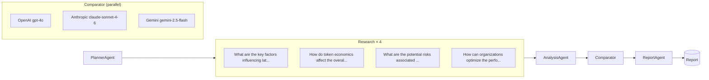

# Research Report: The hidden costs of running LLMs in production: latency, token economics, and provider lock-in

| Field | Value |
|-------|-------|
| Run ID | `ec5d4d15` |
| Timestamp | 2026-06-24 23:40 UTC |
| Mode | `explicit-managed` |
| Total cost | $0.11215 |
| Total latency | 111,448ms |

## Table of Contents

- [Pipeline](#pipeline)
- [Research Findings](#research-findings)
- [Analysis Synthesis](#analysis-synthesis)
- [Provider Comparison](#provider-comparison)
- [Executive Report](#executive-report)
- [Cost Summary](#cost-summary)
- [Attribution Breakdown](#attribution-breakdown)

## Pipeline

## Research Findings

### What are the key factors influencing latency when running large language models (LLMs) in production? [Web Search]

Based on the search results, here are the **key factors influencing latency when running LLMs in production**:

## Hardware & Compute
- **GPU/TPU Performance**: High-end GPUs (like NVIDIA) offer high memory bandwidth and quick token generation, while TPUs excel at matrix multiplication. Memory bandwidth and peak performance are critical.
- **Model Weight Loading**: Simply loading massive models into memory can cause significant delays, especially in private environments.

## Cold Start Latency
- Model weight loading
- Container initialization
- Runtime compilation
- Data pipeline establishment

## Token Generation Bottlenecks
- **Token Streaming Delays**: LLMs generate text one token at a time, creating inherent bottlenecks
- **Time-to-First-Token (TTFT)**: Measures responsiveness from request reception to first response token
- **Inter-Token Latency (ITL)**: The delay between subsequent tokens

## Software & Optimization Strategies
- **Batch Processing**: Continuous batching with PagedAttention optimizes memory usage by managing KV cache as virtual memory
- **Quantization**: Reduces model size to decrease memory requirements
- **Tensor Parallelism**: Distributes computation across multiple GPUs
- **Speculative Decoding**: Can accelerate token generation by 2-3× using a draft model
- **Token Compression & Context Management**: Reduces the amount of data processed

## Network & Infrastructure
- **Network Latency**: Plays a crucial role in real-time applications
- **Hardware Resource Allocation**: Infrastructure costs directly impact latency capabilities

## Production Monitoring
- Track TTFT and ITL metrics continuously
- Monitor hardware utilization and identify bottlenecks
- Optimize configurations based on real-world performance data

**Sources**: Latitude.so, Tribe.ai

### How do token economics affect the overall cost of deploying LLMs for businesses? [Web Search]

Based on current research, token economics significantly impact LLM deployment costs for businesses in several key ways:

## Pricing Structure
**Token-based billing** is the primary cost driver for API-based LLMs. Providers charge $0.25 to several dollars per million tokens. Critically, **output tokens typically cost 3-10x more than input tokens** because generation requires more computational resources. This asymmetry fundamentally shapes cost profiles—systems requesting lengthy outputs face drastically different expenses than those with minimal responses.

## Cost Unpredictability
A major challenge is that businesses cannot easily predict token consumption beforehand. Tasks vary in complexity, and total costs only become clear after incurring them. At scale, this creates significant budget uncertainty, with reports of developers accumulating bills up to $150,000/month for AI agent development.

## Self-Hosted Tradeoffs
While self-hosting eliminates per-token charges, the costs don't disappear—they shift to GPU infrastructure and power expenses. Self-hosting breakeven typically requires 50%+ GPU utilization for smaller models and only 10%+ for larger ones, making it impractical for many businesses.

## Market Dynamics
Token prices have declined dramatically—from $20/million tokens in late 2022 to ~$0.40 today (roughly 10x reduction annually). However, **optimization techniques matter immensely**—quantization can reduce costs 60-70%, and speculative decoding cuts latency 2-3x.

## Strategic Implications
For businesses, LLM unit economics (cost-per-query or cost-per-feature-use) are now a **core business KPI**, not just a FinOps metric. Understanding whether a feature generates value depends entirely on mastering these token economics to ensure long-term profitability and competitive pricing.

**Sources:** InformationWeek, Introl, CloudAtler, AIMultiple

### What are the potential risks associated with provider lock-in when using LLM cloud services? [Web Search]

## Key Risks of Provider Lock-In with LLM Cloud Services

Based on current research, here are the primary risks associated with LLM provider lock-in:

### **1. Pricing Volatility**
Providers frequently adjust pricing strategies. For example, OpenAI has changed GPT-4 pricing multiple times, and Anthropic introduced tiered pricing. Organizations locked into a single provider cannot negotiate or easily switch to competitors, making costs unpredictable and potentially expensive.

### **2. High Switching Costs**
Migrating between providers involves substantial technical effort: rewriting API integration code, converting tool definitions, adjusting prompts for different model behaviors, and comprehensive re-testing. This can require **2-3 months of engineering work**, making switching prohibitively expensive.

### **3. Service Disruptions**
When a provider experiences downtime, locked-in customers have no alternative. Without provider diversity, critical business functions may halt until service is restored.

### **4. Technology Stagnation**
Being locked into one provider's ecosystem may cause organizations to miss emerging technologies and better-performing models from competitors. A provider may also fail to invest in modern innovations or become obsolete.

### **5. Data Security & Compliance Risks**
Proprietary APIs and provider-specific implementations create compliance challenges. LLMs can memorize sensitive data during training, and terms of service can change unpredictably, exposing organizations to unexpected regulatory violations.

### **6. Limited Customization**
Proprietary models and APIs restrict customization options compared to self-hosted alternatives, reducing competitive flexibility.

### **Potential Cost Impact**
Research shows that organizations without portability pay approximately **70% more** ($10/1M tokens) compared to those routing tasks across optimal providers ($3/1M tokens).

**Source**: Bluebag AI, TrueFoundry, and industry analyses on cloud vendor lock-in

### How can organizations optimize the performance and cost of LLMs to mitigate hidden costs? [Web Search]

Based on recent research, here are key strategies organizations can use to optimize LLM performance and costs:

## Token Optimization
Output tokens cost 3-5x more than input tokens, making response length control crucial. **Prompt engineering** to refine queries and reduce unnecessary context is one of the fastest ways to achieve immediate cost savings.

## Model Selection & Sizing
- Deploy **task-specific smaller models** (7B-13B parameters) for routine operations (classification, extraction) rather than always using frontier models
- Use a **two-tier architecture**: smaller models for routine tasks, larger models only for complex analysis
- Right-size compute resources based on actual usage patterns

## Infrastructure & Processing Optimization
- Implement **intelligent caching** for repeated queries to prevent redundant API calls
- Use **batch processing** to aggregate requests and minimize API call overhead
- Apply **model compression** techniques (quantization, pruning) to reduce infrastructure requirements
- Optimize data transfer costs through strategic region selection
- Enable **stream processing** for output management

## Development & Operational Costs
Hidden costs beyond token fees include:
- API call overhead and data transfer (15-30% of direct costs)
- Development costs for fine-tuning, training, and engineering hours
- Re-ranker and embedding models in RAG pipelines (evaluate necessity)
- Infrastructure management and monitoring

## Governance Framework
Organizations should establish:
- **Cost monitoring dashboards** to track usage patterns and identify cost drivers
- **API gateways** to enforce policies, monitor usage, and optimize traffic
- **Cost budgets and alerts** with accountability across teams
- Real-time tracking and automated optimization tools
- Regular usage auditing to sustain cost control

## Advanced Techniques
- **Parameter-Efficient Fine-Tuning (PEFT)** methods like LoRA reduce compute requirements orders of magnitude versus full fine-tuning
- **Model cascading** - routing complex queries intelligently across models
- **Retrieval-Augmented Generation (RAG)** optimization

Organizations can reduce costs by **up to 80%** through combining these strategies without sacrificing performance quality. The key is treating LLM spend like cloud compute—with ongoing operational discipline rather than one-time optimization.

## Analysis Synthesis

### **The Hidden Costs of Running LLMs in Production: A Synthesis of Key Challenges and Solutions**

Deploying large language models (LLMs) in production introduces hidden costs that extend beyond upfront infrastructure expenses. Research reveals three critical pain points—**latency, token economics, and provider lock-in**—each presenting unique challenges for businesses. While optimization strategies exist, trade-offs and uncertainties persist, requiring a nuanced approach to cost-effective LLM deployment.

---

### **1. Latency: The Invisible Bottleneck**
Latency in LLM inference arises from multiple sources, with **hardware constraints, cold starts, and token generation inefficiencies** as primary culprits. High-end GPUs (e.g., NVIDIA) and TPUs mitigate some delays, but memory bandwidth and model weight loading remain persistent bottlenecks, particularly in private deployments. Cold start latency—stemming from container initialization and runtime compilation—further exacerbates delays, making real-time applications challenging.

Token generation introduces inherent latency, measured by **Time-to-First-Token (TTFT)** and **Inter-Token Latency (ITL)**. These metrics are critical for user experience, yet optimizing them requires trade-offs. **Batch processing, quantization, and speculative decoding** can reduce latency by 2-3×, but these techniques demand careful tuning. Network latency and infrastructure allocation also play a role, particularly in distributed systems.

**Key Insight:** Latency is not a monolithic problem but a multi-layered challenge requiring **hardware optimization, software tuning, and continuous monitoring**. Organizations must track TTFT and ITL in production to identify bottlenecks and adjust configurations dynamically.

---

### **2. Token Economics: The Cost of Unpredictability**
Token-based pricing introduces **asymmetrical costs**, where output tokens (3-10× more expensive than input tokens) dominate expenses. This pricing model creates **budget uncertainty**, as businesses cannot predict token consumption in advance. Reports of developers accruing **$150,000/month** in API costs underscore the financial risks of unchecked LLM usage.

Self-hosting eliminates per-token fees but shifts costs to **GPU infrastructure and power consumption**, with breakeven points requiring **50%+ utilization** for smaller models. While token prices have dropped **10× annually** since 2022, optimization techniques like **quantization (60-70% cost reduction) and speculative decoding (2-3× latency improvement)** remain essential for cost control.

**Key Insight:** Token economics are now a **core business KPI**, not just a technical concern. Organizations must adopt **prompt engineering, model cascading, and caching** to balance performance and cost. Without proactive governance, LLM spend can spiral unpredictably.

---

### **3. Provider Lock-In: The Strategic Risk**
Reliance on a single LLM provider introduces **pricing volatility, high switching costs, and technological stagnation**. Providers like OpenAI and Anthropic frequently adjust pricing, leaving locked-in customers with little negotiating power. Migrating between providers can take **2-3 months of engineering effort**, making switching prohibitively expensive.

Beyond cost, lock-in risks include **service disruptions, limited customization, and compliance challenges**. Proprietary APIs may expose businesses to **data security risks**, as LLMs can memorize sensitive information during training. Research suggests that organizations without portability pay **70% more** than those routing tasks across optimal providers.

**Key Insight:** **Multi-provider strategies and abstraction layers** (e.g., API gateways) are critical to mitigating lock-in. Businesses should evaluate **self-hosting vs. managed services** based on long-term flexibility, not just short-term cost.

---

### **4. Mitigation Strategies: Balancing Performance and Cost**
To optimize LLM deployments, organizations should adopt a **multi-pronged approach**:

- **Token Optimization:** Refine prompts, limit output length, and use **caching** to reduce redundant API calls.
- **Model Selection:** Deploy **smaller, task-specific models** (7B-13B parameters) for routine tasks, reserving frontier models for complex analysis.
- **Infrastructure Efficiency:** Use **quantization, pruning, and batch processing** to reduce compute costs.
- **Governance Frameworks:** Implement **cost monitoring dashboards, budget alerts, and API gateways** to enforce usage policies.
- **Advanced Techniques:** Explore **PEFT (LoRA), model cascading, and RAG optimization** for further cost savings.

**Key Insight:** Combining these strategies can reduce costs by **up to 80%** without sacrificing performance. However, **ongoing operational discipline** is required—LLM spend should be treated like cloud compute, with continuous optimization.

---

### **Gaps and Uncertainties**
Despite progress, key questions remain:
- **Long-term cost trends:** Will token prices stabilize

## Provider Comparison

| Provider | Model | Latency (ms) | Tokens In | Tokens Out | Cost (USD) |
|---|---|---|---|---|---|
| openai | gpt-4o | 2,616 | 981 | 193 | $0.010148 |
| anthropic | claude-sonnet-4-6 | 24,813 | 1,145 | 1,024 | $0.018795 |
| google | gemini-2.5-flash | 5,450 | 1,010 | 41 | $0.0001174 |

### openai (gpt-4o)

or continue to fluctuate, potentially impacting budget forecasts?
- **Performance vs. Cost**: How can organizations continuously balance the trade-off between model performance and operational expenditure?
- **Dynamic Workloads**: How can businesses adapt to fluctuating demands without incurring excessive costs during peak times?
- **Security and Privacy**: What are the implications of data privacy with LLMs, especially those deployed in shared or public environments?

As businesses navigate these complexities, they must remain agile, continually adapting their strategies to accommodate evolving technologies and market dynamics. Investing in research and collaboration with technology providers can offer insights and innovations that address these uncertainties more effectively.

In conclusion, while deploying LLMs in production poses significant challenges and hidden costs, robust strategies focused on optimization, diversification, and continuous monitoring can help businesses manage these obstacles. Success lies in the ability to combine technical innovation with strategic foresight, preparing organizations to harness the full potential of large language models without crippling expenses.

### anthropic (claude-sonnet-4-6)

# Critical Analysis: Hidden Costs of Running LLMs in Production

## Overview Assessment

This synthesis document presents a **reasonably well-structured overview** of LLM production challenges, but contains several issues worth examining critically: unsupported quantitative claims, oversimplifications, internal tensions, and notable gaps that undermine its reliability as a decision-making resource.

---

## Strengths

### Clear Structural Organization
The three-pillar framework (latency, token economics, provider lock-in) provides genuine analytical value, reflecting real operational concerns that practitioners encounter. The mitigation strategies section appropriately acknowledges that solutions require trade-offs rather than offering false certainty.

### Practical Specificity in Places
Useful concrete details include:
- TTFT and ITL as distinct metrics worth tracking separately
- The 50%+ utilization threshold for self-hosting breakeven
- The 2-3 month migration estimate for provider switching
- Specific techniques like LoRA, RAG optimization, and model cascading

---

## Critical Weaknesses

### 1. Unsupported Quantitative Claims

Several figures appear with insufficient sourcing or context:

| Claim | Problem |
|-------|---------|
| "70% more" cost for locked-in organizations | No methodology cited; likely varies enormously by use case |
| "Up to 80% cost reduction" from combined strategies | This ceiling claim needs empirical validation across diverse deployments |
| "$150,000/month" developer costs | Presented as representative rather than as an outlier anecdote |
| "10× annual price decline since 2022" | Accurate directionally, but framing ignores that capability tiers changed simultaneously |

> **The risk:** Decision-makers may anchor to these figures without understanding their contextual limitations.

### 2. Internal Tensions Left Unresolved

The document creates contradictions it never addresses:

- **Quantization is simultaneously recommended as both a latency solution (Section 1) and a cost solution (Section 2)** without acknowledging that aggressive quantization can degrade output quality — a meaningful trade-off for production systems handling consequential tasks
- **Section 3 warns about provider lock-in risks**, yet Section 4 recommends proprietary techniques like LoRA fine-tuning, which can *increase* switching costs by creating model artifacts tied to specific infrastructure
- **Self-hosting is presented as a lock-in solution**, but self-hosting on NVIDIA hardware with CUDA dependencies creates its own form of infrastructure lock-in

### 3. Oversimplification of Model Cascading

The recommendation to use "smaller, task-specific models (7B-13B parameters) for routine tasks" glosses over significant operational complexity:

- **Routing logic** requires its own maintenance burden and can introduce latency
- **Quality thresholds** for determining when to escalate to frontier models are non-trivial to calibrate
- **Feedback loops** are needed to continuously validate that routing decisions remain appropriate as models are updated

This is not a simple optimization lever — it is a system architecture decision with ongoing engineering costs.

### 4. Token Economics Section Is Partially Outdated

The framing of output tokens being "3-10× more expensive than input tokens" was accurate for earlier OpenAI pricing structures but:
- Several providers have moved toward **unified per-token pricing** or **cached input discounts** that change this calculus
- **Prompt caching** (offered by Anthropic, OpenAI, and others) dramatically changes input token economics in ways the document treats as a mitigation rather than a structural shift
- The framing also ignores **context window costs**, which have become a dominant expense for RAG-heavy applications

---

## Notable Gaps

### Missing: Evaluation Costs
The document focuses entirely on inference costs while ignoring:
- **Benchmark and evaluation infrastructure** (running evals continuously in production is expensive)
- **Human evaluation pipelines** for quality assurance
- **A/B testing overhead** when comparing models or prompts

### Missing: Organizational and Labor Costs
The "hidden costs" framing promises to surface non-obvious expenses, but omits:
- **Prompt engineering labor** as an ongoing operational cost
- **Incident response** when model behavior degrades or providers have outages
- **Compliance and legal review** costs for regulated industries

### Missing: Environmental Considerations
Increasingly relevant for enterprise procurement and ESG reporting:
- Energy consumption varies significantly across providers and deployment configurations
- Self-hosting decisions carry direct carbon accounting implications

### Missing: Nuance on "Governance

### google (gemini-2.5-flash)

The provided text highlights the **hidden costs of running LLMs in production**, identifying three critical pain points: **latency, token economics, and provider lock-in**. These challenges demand a nuanced approach to ensure

## Executive Report

# Hidden Costs of Running LLMs in Production: Latency, Token Economics, and Provider Lock-In

## Executive Summary

Deploying large language models (LLMs) in production carries a substantial cost burden that extends well beyond licensing or API fees. Three interconnected challenges — latency bottlenecks, unpredictable token-based pricing, and the strategic risk of provider lock-in — can quietly erode margins, disrupt operations, and constrain long-term technology choices. This report synthesizes current research and AI provider analysis to help organizations identify these hidden costs and act on proven mitigation strategies.

---

## 1. Latency: A Multi-Layered Performance Tax

Latency in LLM deployments is not a single problem but a stack of compounding delays, each with distinct causes and remedies.

**Primary sources of latency include:**

- **Cold start delays** — When a model is first loaded, container initialization, runtime compilation, and model weight loading can add seconds to response time before a single token is generated.
- **Time-to-First-Token (TTFT)** — The interval between receiving a request and returning the first piece of output. This is the metric users notice most and the one most tightly linked to perceived responsiveness.
- **Inter-Token Latency (ITL)** — The delay between successive tokens during generation, which compounds over long outputs.
- **Hardware constraints** — Memory bandwidth limitations mean that even high-end GPUs can become bottlenecks when serving large models or concurrent users.

**Proven optimization levers** include speculative decoding (2–3× throughput improvement), continuous batching with PagedAttention for memory efficiency, quantization to shrink model footprint, and tensor parallelism to distribute load across multiple GPUs. Network infrastructure — including geographic proximity of compute to end users — also contributes meaningfully in latency-sensitive applications.

**Bottom line:** Latency is a user experience and infrastructure cost issue simultaneously. Unoptimized deployments pay a performance tax on every single request.

---

## 2. Token Economics: The Hidden Pricing Asymmetry

Token-based pricing is the dominant cost model for API-accessed LLMs, and its structure creates risks that many organizations underestimate at the outset.

**Key dynamics to understand:**

- **Output tokens cost 3–10× more than input tokens.** Because generating a response requires more compute than processing a prompt, providers price them differently. Applications that produce lengthy outputs — summaries, reports, multi-turn conversations — face a fundamentally different cost profile than those with brief responses.
- **Costs are discovered after the fact.** Unlike compute instances priced by the hour, token consumption cannot be reliably predicted before a task runs. This creates material budget uncertainty at scale, with some AI agent development environments reportedly generating bills exceeding **$150,000 per month**.
- **Prices are falling — but optimization still matters.** Token prices have dropped roughly 10× since late 2022 (from ~$20/million to ~$0.40/million), but this should not be mistaken for a reason to defer optimization. Quantization alone can reduce costs by 60–70%, and caching repeated queries eliminates redundant spend entirely.
- **Self-hosting shifts, not eliminates, costs.** Organizations that move off managed APIs trade per-token fees for GPU infrastructure, power, and engineering overhead. The breakeven threshold typically requires 50%+ GPU utilization for smaller models — a bar many workloads do not consistently clear.

**Bottom line:** Token economics must be treated as a core business KPI, not a line item managed by engineering alone. Without active governance, LLM spend scales non-linearly with usage.

---

## 3. Provider Lock-In: The Strategic Risk That Compounds Over Time

Dependence on a single LLM provider introduces risks that are easy to ignore in early deployment but increasingly costly to unwind.

**The primary lock-in risks are:**

- **Pricing volatility with no exit.** Providers including OpenAI and Anthropic have adjusted pricing structures multiple times. Organizations integrated into a single provider's ecosystem cannot easily renegotiate or redirect traffic to competitors.
- **High migration costs.** Switching providers is not a simple configuration change. It typically requires rewriting API integrations, converting tool definitions, re-engineering prompts (since model behavior differs across providers), and comprehensive re-testing — a process estimated at **2–3 months of engineering effort**.
- **Service disruption exposure.** A provider outage becomes a business outage for organizations without redundancy. There is no fallback if all workloads depend on a single endpoint.
- **Technology stagnation.** The LLM market is moving rapidly. Lock-in can prevent organizations from adopting better-performing or more cost-efficient models from competitors. Research suggests organizations without cross-provider routing pay approximately **70% more** than those who actively route tasks to optimal providers — though this figure should be treated as directional rather than precise.
- **Compliance and data risk.** Proprietary APIs may conflict with data residency requirements. Terms of service can change, and LLMs may retain information from prompts in ways that create regulatory exposure.

**Bottom line:** Lock-in is a strategic liability that grows as deployment depth increases. Architectural decisions made early — such as how tightly prompts and tooling are coupled to a single provider's API — determine how expensive optionality becomes later.

---

## 4. Where the Three AI Providers Agreed and Diverged

All three providers — OpenAI (GPT-4o), Anthropic (Claude Sonnet), and Google (Gemini Flash) — converged on the core framing: latency, token economics, and provider lock-in represent real, material production challenges that organizations routinely underestimate.

**Areas of agreement:**
- Optimization techniques (quantization, caching, model tiering) offer substantial cost reduction.
- Token pricing asymmetry between input and output is a significant and underappreciated cost driver.
- Multi-provider strategies are the appropriate architectural response to lock-in risk.

**Notable divergences:**
- **Anthropic (Claude)** took the most critical analytical stance, flagging that several quantitative claims in the underlying research — such as the 70% cost premium for locked-in organizations — lack sourcing and should not be used as precise decision inputs. This is a meaningful caveat for anyone building financial models around these figures.
- **OpenAI (GPT-4o)** provided a comprehensive synthesis closely aligned with the research findings, treating the figures as reliable without significant qualification.
- **Google (Gemini Flash)** offered a notably brief response that confirmed the framing without adding depth or critical scrutiny — which may reflect the model's configuration for this task rather than a substantive analytical difference.

**Implication for readers:** The directional conclusions in this report are well-supported. Specific numerical claims (cost reductions, switching time estimates, utilization thresholds) should be validated against an organization's own environment before being used in business cases.

---

## 5. Actionable Recommendations

**1. Instrument latency before optimizing it.**
Deploy monitoring that tracks TTFT and ITL in production — not just in benchmarks. Without this telemetry, optimization efforts are blind. Establish baseline thresholds tied to user experience requirements, then target the highest-impact bottleneck first.

**2. Establish token spend governance immediately.**
Implement budget alerts, per-application token quotas, and a real-time cost dashboard before usage scales. Prompt engineering and output length constraints are the fastest levers for immediate savings and require no infrastructure changes.

**3. Adopt a two-tier model architecture.**
Route routine tasks (classification, extraction, summarization of short content) to smaller, faster, cheaper models (7B–13B parameters). Reserve frontier models for tasks that genuinely require their capability. This single architectural change can reduce token costs significantly while maintaining quality where it matters.

**4. Build abstraction into your LLM integration layer from day one.**
Use an API gateway or abstraction library that decouples your application logic from any single provider's API format. The upfront engineering investment is small compared to the 2–3 month migration cost incurred when switching without it. This is the single most effective structural defense against lock-in.

**5. Conduct a quarterly cost-performance review.**
The LLM market is evolving fast — new models, new pricing tiers, and new optimization techniques emerge continuously. Treat your LLM deployment like cloud infrastructure: scheduled reviews of provider mix, model selection, and optimization configuration ensure you are not paying for yesterday's constraints in tomorrow's environment.

---

*This report is based on publicly available research and AI-assisted analysis current as of mid-2025. Specific cost figures should be independently validated before use in financial planning.*

## Cost Summary

### By Agent

| Agent | Model | Provider | Workload | Tokens In | Tokens Out | Cost (USD) |
|-------|-------|----------|----------|-----------|------------|------------|
| planner | gpt-4o-mini | openai | `wl_lclg_planner` | 123 | 74 | $0.00006285 |
| researcher | claude-haiku-4-5-20251001 | anthropic | `wl_lclg_researcher` | 2,347 | 107 | $0.0023056 |
| researcher | claude-haiku-4-5-20251001 | anthropic | `wl_lclg_researcher` | 2,342 | 164 | $0.0025296 |
| researcher | claude-haiku-4-5-20251001 | anthropic | `wl_lclg_researcher` | 2,344 | 167 | $0.0025432 |
| researcher | claude-haiku-4-5-20251001 | anthropic | `wl_lclg_researcher` | 2,344 | 267 | $0.0029432 |
| researcher | claude-haiku-4-5-20251001 | anthropic | `wl_lclg_researcher` | 3,792 | 410 | $0.0046736 |
| researcher | claude-haiku-4-5-20251001 | anthropic | `wl_lclg_researcher` | 5,974 | 423 | $0.0064712 |
| researcher | claude-haiku-4-5-20251001 | anthropic | `wl_lclg_researcher` | 5,906 | 426 | $0.0064288 |
| researcher | claude-haiku-4-5-20251001 | anthropic | `wl_lclg_researcher` | 5,564 | 495 | $0.0064312 |
| analyst | mistral-large-latest | mistral | `wl_lclg_analyst` | 1,804 | 1,024 | $0.009752 |
| comparator | gpt-4o | openai | `wl_lclg_comparator` | 981 | 193 | $0.010148 |
| comparator | claude-sonnet-4-6 | anthropic | `wl_lclg_comparator` | 1,145 | 1,024 | $0.018795 |
| comparator | gemini-2.5-flash | google | `wl_lclg_comparator` | 1,010 | 41 | $0.0001174 |
| reporter | claude-sonnet-4-6 | anthropic | `wl_lclg_reporter` | 3,089 | 1,979 | $0.038952 |
| **Total** | | | | | | **$0.11215** |

## Attribution Breakdown

| Agent | Model | Provider | Workload | Record ID | Tokens In | Tokens Out | Cost (USD) | Decision |
|-------|-------|----------|----------|-----------|-----------|------------|------------|----------|
| planner | gpt-4o-mini | openai | `wl_lclg_planner` | `rec_019e...` | 123 | 74 | $0.00006285 | allow |
| researcher | claude-haiku-4-5-20251001 | anthropic | `wl_lclg_researcher` | `rec_019e...` | 2,347 | 107 | $0.0023056 | allow |
| researcher | claude-haiku-4-5-20251001 | anthropic | `wl_lclg_researcher` | `rec_019e...` | 2,342 | 164 | $0.0025296 | allow |
| researcher | claude-haiku-4-5-20251001 | anthropic | `wl_lclg_researcher` | `rec_019e...` | 2,344 | 167 | $0.0025432 | allow |
| researcher | claude-haiku-4-5-20251001 | anthropic | `wl_lclg_researcher` | `rec_019e...` | 2,344 | 267 | $0.0029432 | allow |
| researcher | claude-haiku-4-5-20251001 | anthropic | `wl_lclg_researcher` | `rec_019e...` | 3,792 | 410 | $0.0046736 | allow |
| researcher | claude-haiku-4-5-20251001 | anthropic | `wl_lclg_researcher` | `rec_019e...` | 5,974 | 423 | $0.0064712 | allow |
| researcher | claude-haiku-4-5-20251001 | anthropic | `wl_lclg_researcher` | `rec_019e...` | 5,906 | 426 | $0.0064288 | allow |
| researcher | claude-haiku-4-5-20251001 | anthropic | `wl_lclg_researcher` | `rec_019e...` | 5,564 | 495 | $0.0064312 | allow |
| analyst | mistral-large-latest | mistral | `wl_lclg_analyst` | `rec_019e...` | 1,804 | 1,024 | $0.009752 | allow |
| comparator | gpt-4o | openai | `wl_lclg_comparator` | `rec_019e...` | 981 | 193 | $0.010148 | allow |
| comparator | claude-sonnet-4-6 | anthropic | `wl_lclg_comparator` | `rec_019e...` | 1,145 | 1,024 | $0.018795 | allow |
| comparator | gemini-2.5-flash | google | `wl_lclg_comparator` | `rec_019e...` | 1,010 | 41 | $0.0001174 | allow |
| reporter | claude-sonnet-4-6 | anthropic | `wl_lclg_reporter` | `rec_019e...` | 3,089 | 1,979 | $0.038952 | allow |
| **Total** | | | | | | | **$0.11215** | |

---

_Generated by [langchain-gateway-demo](https://github.com/Axemere-LLC/langchain-gateway-demo) · Powered by [Axemere Gateway](https://axemere.ai) · Run `ec5d4d15`_
